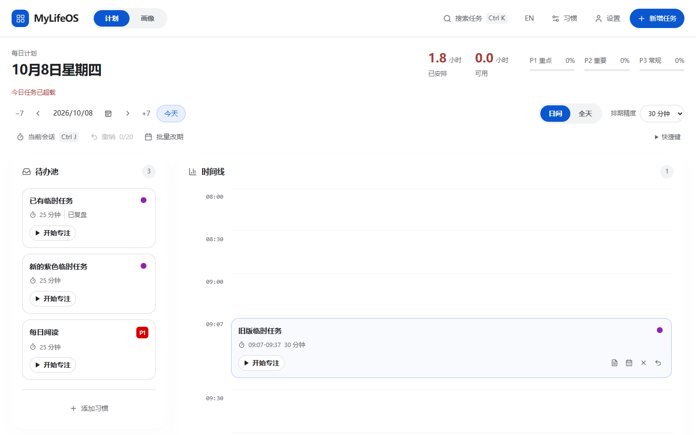
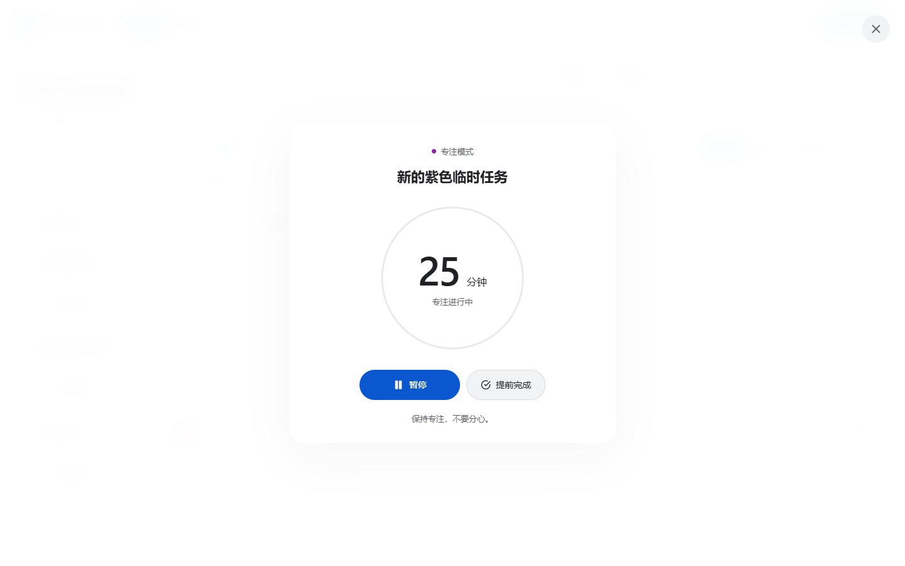

# 临时任务无优先级（2026-10-08）

已有、新增及旧备份导入的临时任务均使用 `none`，任务卡片和专注标识统一为 Google Calendar 紫色 `#8e24aa`。新建临时任务不再提供优先级选择。习惯及其生成任务仍保留 P1/P2/P3。

## 数据与行为

- 读取旧临时任务时转换展示模型，不在读取时覆盖原文件；正常写入及原生专注完成时持久化无优先级。无 origin 且无 habitId 的历史任务也按临时任务处理。
- 保留 ID、排期、时长、备注、复盘、完成状态。带 habitId 的历史习惯任务仍保留优先级，即使对应习惯已删除。
- 搜索增加“无优先级 / No priority”。临时任务专注仍计入总时长，优先级统计单列“无优先级”，不混入 P1/P2/P3。
- Windows 历史会话只对能关联到临时任务的记录归入无优先级；习惯会话保留当时记录的优先级。
- 标准备份保留 `none`，schema 版本不变。显式导出给旧版本的兼容格式将临时任务写为 P3，因为旧版本不支持 none；更新后的应用导入时恢复为无优先级。旧应用应使用兼容导出，不能直接读取新的标准备份。

## 验证

- Windows：34 个测试文件、238 项测试通过；前端和 Electron 类型检查通过。
- Android：24 个测试文件、160 项测试通过；前端和 Electron 类型检查通过。
- Android 离线 JVM：SnapshotRules 13 项测试通过，包括旧临时任务原生完成保存及拒绝无优先级习惯任务。未打包或安装 APK。
- 隔离浏览器：旧任务、新任务、遗留任务、移除选择器、搜索、紫色标识、暂停、390px 无横向溢出均通过（14 项检查）。
- 隔离 Electron：200% 缩放、重复点击只启动一次、暂停、关闭重开、进程重启恢复、完成持久化、休息结束均通过（9 项检查）。任务及新专注会话均保存 none，09:07 排期保持不变。
- 两次独立代码审查；相关恢复边界已修复并补充测试。所有自动化使用隔离数据，没有更改日常应用数据。

## 预览证据

下列截图来自 Windows UI 分支的隔离浏览器。

