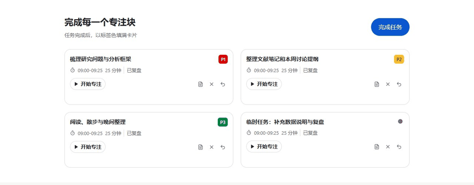
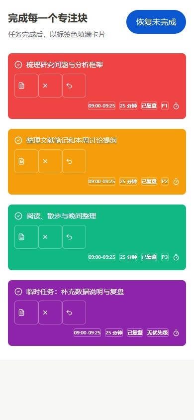

# 任务完成反馈（2026-10-09）

任务和习惯生成的任务块在完成后，以当前标签色填充整块卡片。名称、时长、标签文字和操作图标同步变为白色；临时任务为紫色，习惯任务沿用当前平台的 P1/P2/P3 标签色。保留完成勾号，去掉灰色淡化和删除线，布局与完成存储语义不变。

- 原生 CSS 背景、文字和边框颜色同步过渡 400ms，快速状态反转可以中断。
- 已有完成记录初次加载时直接呈现最终颜色；重新渲染不重播。
- `prefers-reduced-motion` 时直接切换终态；悬停和键盘聚焦保持完成颜色。
- P2 沿用黄色标签色，白字使用细文字阴影辅助辨认。

## 验证

- 两端前端类型检查通过；Windows 已有 TaskCard/ManualTaskModal 测试 5 项通过，Android ManualTaskModal 测试 3 项通过。
- 使用两个分支的真实 TaskCard 组件进行隔离浏览器验证，每端 8 组检查通过：四种终态颜色，名称/元数据/按钮白字，中间帧，悬停聚焦，快速反转，历史完成初次加载，减少动态效果，无横向溢出。
- Windows 隔离 Electron 实际专注完成及保存后的卡片显示验证通过；没有改变业务完成判定或数据格式。Android 卡片在浏览器中验证，未安装 APK 或进行真机验收。
- 实际画面自检完成；本次局部样式修改未进行独立视觉评审。截图工具记录的唯一控制台问题为既有 `/favicon.ico` 404。
- 动效证据使用真实组件的隔离状态切换；浏览器组件预览不代表业务提交。GIF 由录制帧组成，原始开始/中间/结束帧一并保留。

